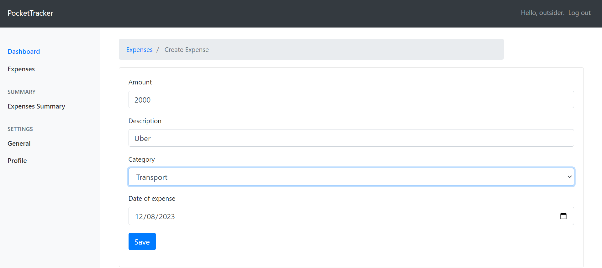
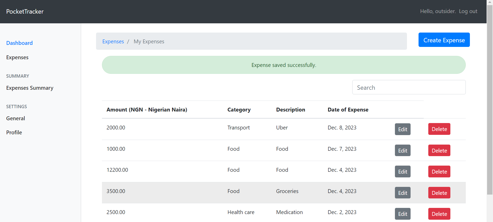
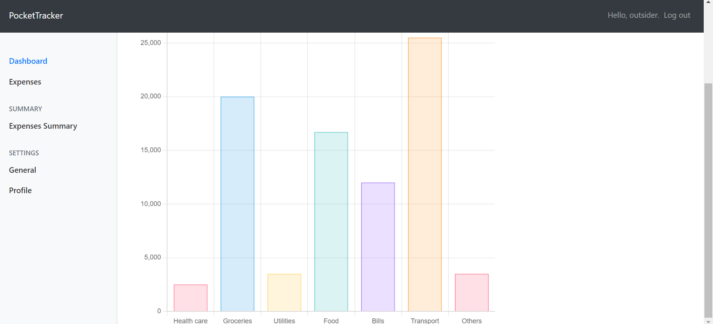

# Features

- Real time transaction tracking:
Effortlessly record your expenses as they happen, ensuring accurate and up-to-date financial insights. The intuitive interface allows you to categorize transactions with a few taps, providing a comprehensive overview of your financial activity.

  

  

+ Expense reports: Visualize your spending patterns and gain valuable insights into your financial behavior.

  

# About

Our project is more than lines of code; it's a personal journey sparked by a desire for financial empowerment. Frustrated with traditional expense trackers, we set out to create a tool that resonates with real-life challenges.

This endeavor isn't just a Holberton assignment—it's a portfolio project reflecting our dedication to impactful solutions.

# Project Repository

Check the repo here: [GitHub](https://github.com/babafemiolatona/pocket-tracker)
